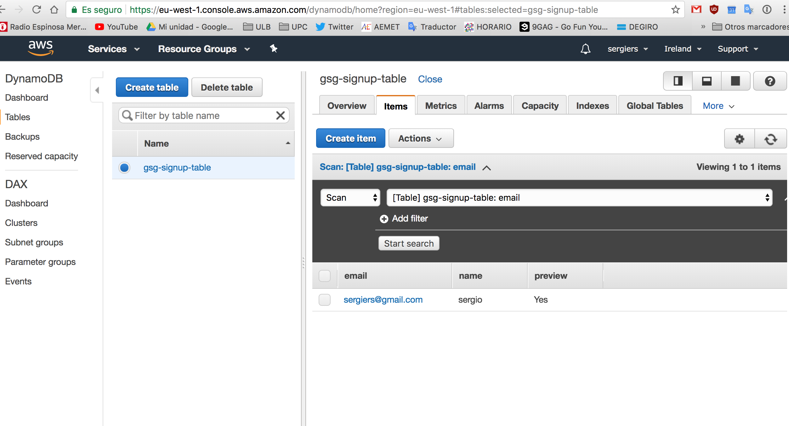
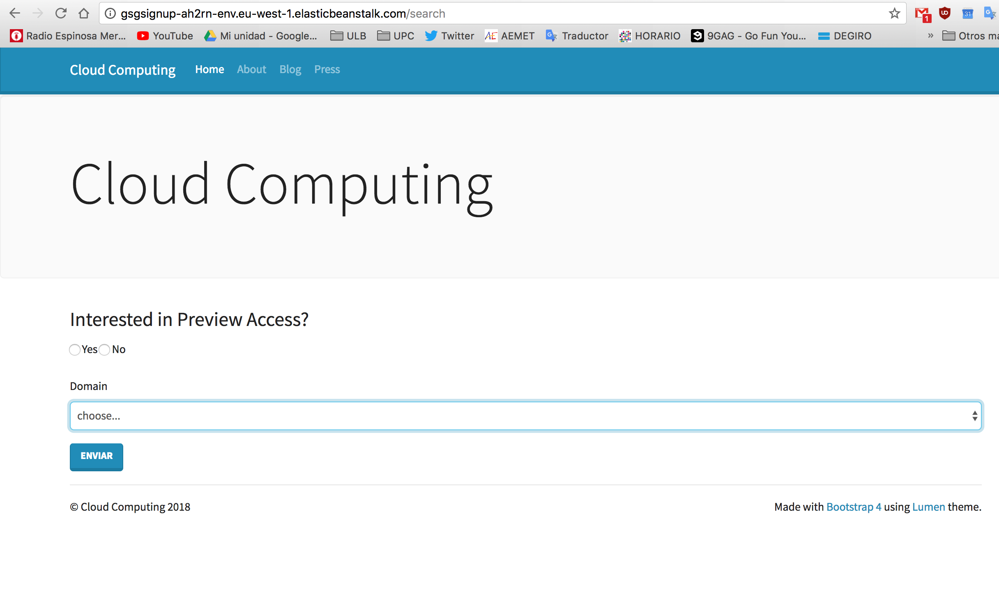

# Enhancing web apps using additional cloud services
  
* Sergio Ruiz: __sergiers@opendeusto.es__
* Dagoberto Herrera: __dagobertoherreramurillo@live.com__


## 5.1 Use Amazon Simple Notification Service in your web app

First, we create an SNS subscription and added the variables to the machine:


Following the tutorial for the inital setup, we found that we need to configurate the LOCAL variables in our compurers. To do so, we run:

```
$ export NEW_SIGNUP_TOPIC=""
$ export STARTUP_SIGNUP_TABLE=""
$ export DEBUG==TRUE
$ export AWS_REGION="eu-west-1"
```


We configure the notification settings, by addig the code:

```
def send_notification(self, email):
    sns = boto3.client('sns', region_name=AWS_REGION)
    try:
        sns.publish(
            TopicArn=NEW_SIGNUP_TOPIC,
            Message='New signup: %s' % email,
            Subject='New signup',
        )
        logger.error('SNS message sent.')

    except Exception as e:
        logger.error(
            'Error sending SNS message: ' + (e.fmt if hasattr(e, 'fmt') else '') + ','.join(e.args))
```


```
def signup(request):
    leads = Leads()
    status = leads.insert_lead(request.POST['name'], request.POST['email'], request.POST['previewAccess'])
    if status == 200:
        leads.send_notification(request.POST['email'])
    return HttpResponse('', status=status)
```

And the IAM policy:

```
{
    "Version": "2012-10-17",
    "Statement": [
        {
            "Sid": "VisualEditor0",
            "Effect": "Allow",
            "Action":["sns:Publish","dynamodb:PutItem"],
            "Resource": "*"
        }
    ]
}
```

Then, test both the local and cloud web.

we deploy:

`eb deploy`

Once the new version is deployed, we insert a new email. Everything works fine both in local and cloud:


The inserts:




And the notification to the email:


## Task 5.2: Create a new option to retrieve the list of leads

First, we add a new path in form/urls.py to let Django knows that there exists a path "/search" that points to our new html file.

Then we modify the backend, by creating the controller for the new view in `form/views.py`:

```python
def search(request):
    domain = request.GET.get('domain')
    preview = request.GET.get('preview')
    leads = Leads()
    items = leads.get_leads(domain, preview)
    if domain or preview:
        return render(request, 'search.html', {'items': items})
    else:
        domain_count = Counter()
        domain_count.update([item['email'].split('@')[1] for item in items])
        return render(request, 'search.html', {'domains': sorted(domain_count.items())})
```


Here, we have the template and part of the backend, but we need to retrive the elements from the DB. For doing this, we created the method "get_leads(self, domain, preview)" in "form/models.py". Now our code is complete, and we can use the new view, that successfully connected to the DB, as the images shows.


We finally add a new element to the bootstrap template:
```html
 <ul class="nav navbar-nav ml-auto">
        <li class="nav-item"><a class="nav-link" href="">Admin search</a></li>
 </ul>
```


We deploy and test both local and cloud:


In local: 


In cloud:



NOTE: the screenshots were before adding the `Admin search`


## Task 5.3: Improve the web app transfer of information (optional)

Because the extreme workload of the master, specially these weeks, this group could not implement this part. However, we had time to make some research about [how to do the COUNT in the DynamoDB-side](https://stackoverflow.com/questions/27316643/how-to-get-item-count-from-dynamodb?utm_medium=organic&utm_source=google_rich_qa&utm_campaign=google_rich_qa). Amazon Web Services also include some ways to make regular expresion [querying](https://docs.aws.amazon.com/amazondynamodb/latest/developerguide/Query.html) than can help. Because DynamoDB does not support aggregation, we have to think in other ways. A simple solution can be, for example, to create a new table with the @domain and a count. Each time we insert a new email, we can simply add +1 to the existing value, or creating a new if it does not exist.  After making the server do this part, we just need to get the result of the count, and add it to the frontend with the [Django template language](https://docs.djangoproject.com/en/1.9/ref/templates/language/).


## Task 5.4: Deliver static content using a Content Delivery Network


First, we are going to add our static css, instead of using bootstrap's one:

`<link href="" rel="stylesheet">`


The new web is much beautiul now:


Now, we are going to create a CloudFront for reduce our server's load, by first uploading our static content into a S3 bucket and spreading it with a CDN. Then, following [the tutorial,](https://docs.aws.amazon.com/AmazonCloudFront/latest/DeveloperGuide/GettingStarted.html) we now have our static content spreaded in some regions. Here are some screenshots of the process:


And then, check if this file exist for the public in the S3 bucket:


Now, we just need to change the links in the html, to point to this new files:

`<link href="d5lwf64y86bmy.cloudfront.net/custom.css" rel="stylesheet">`

Here is the prove that the css is coming from this new source:


As we can see, css is coming from the CDN


### Django support for CDN

We finally add the storages to the settings.py:

```
INSTALLED_APPS = [

    'storages',
]

```

And the rest:
```
DEFAULT_FILE_STORAGE = 'storages.backends.s3boto3.S3Boto3Storage'
STATICFILES_STORAGE = 'storages.backends.s3boto3.S3Boto3Storage'
AWS_STORAGE_BUCKET_NAME = "eb-django-express-signup-YOUR-ID"
AWS_S3_CUSTOM_DOMAIN = 'RANDOM-ID-FROM-CLOUDFRONT.cloudfront.net'
```


We are now in the end of the lab. We deleted the CDN, just to avoid Amazon surprises in the bill.


## Some problems faced:

Well, of course we had it. After struggling with code, we finally could solve everything. For example, we had no access to the DynamoDB search, from the '/search' path in the server. We fixed this by taking a look to the logs of the server. After notice that is a privilege problem, we fixed it in the IAM policy:


Other minor things, are some minor errors in the tutorial. For example, at some point, the tutorial refers to the `gsm-signup-policy` instead of the `gsg-signup-policy`

From the lab04: We noticed that the instance for the server was changed from `t2.micro` to `t2.nano` which is not included in the free tier. So after knowing this, we finally launched the `t2.micro`, but with a bill of 0.01€.

We also deleted the last repo with the code, and created again, because we had to face some problems in lab04. Code is now available in the [new repo.](https://github.com/sergiers3/eb-django-express-signup)


